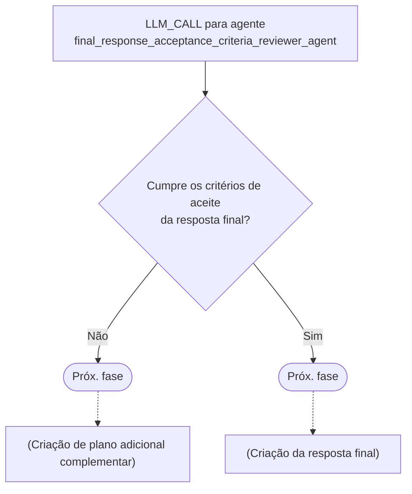

```mermaid
flowchart TD

    A["LLM_CALL para agente<br/>final_response_acceptance_criteria_reviewer_agent"]

    B{"Cumpre os critérios de aceite<br/>da resposta final?"}

    C([Próx. fase])
    D["(Criação de plano adicional complementar)"]

    E([Próx. fase])
    F["(Criação da resposta final)"]

    A --> B

    B -- Não --> C
    C -.-> D

    B -- Sim --> E
    E -.-> F
```
