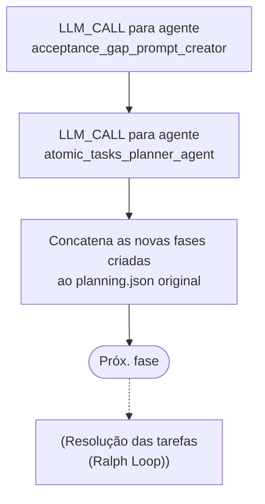

```mermaid
flowchart TD

    A["LLM_CALL para agente<br/>acceptance_gap_prompt_creator"]

    B["LLM_CALL para agente<br/>atomic_tasks_planner_agent"]

    C["Concatena as novas fases criadas<br/>ao planning.json original"]

    D([Próx. fase])

    E["(Resolução das tarefas<br/>(Ralph Loop))"]

    A --> B
    B --> C
    C --> D

    D -.-> E
```
