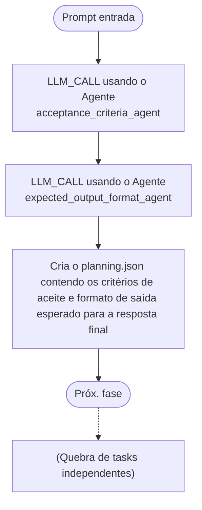

```mermaid
flowchart TD

    A([Prompt entrada])

    B["LLM_CALL usando o Agente<br/>expected_output_format_agent"]

    C["LLM_CALL usando o Agente<br/>acceptance_criteria_agent"]

    D["Cria o planning.json contendo os critérios de aceite e formato de saída esperado para a resposta final"]

    E([Próx. fase])
    F["(Quebra de tasks independentes)"]

    A --> C
    C --> B
    B --> D
    D --> E

    E -.-> F
```
