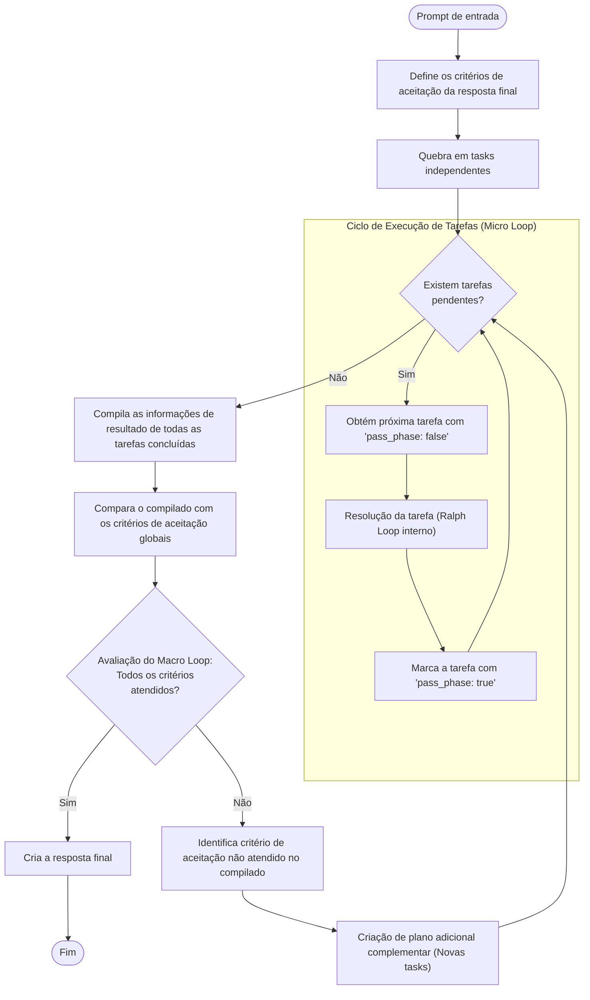

```mermaid
flowchart TD

    A([Prompt de entrada])

    B["Define os critérios de aceitação da resposta final"]
    C["Quebra em tasks independentes"]

    subgraph Processamento ["Ciclo de Execução de Tarefas (Micro Loop)"]
        direction TB
        TaskCheck{"Existem tarefas<br>pendentes?"}
        GetTask["Obtém próxima tarefa com 'pass_phase: false'"]
        ResolveTask["Resolução da tarefa (Ralph Loop interno)"]
        UpdateTask["Marca a tarefa com 'pass_phase: true'"]

        TaskCheck -- Sim --> GetTask
        GetTask --> ResolveTask
        ResolveTask --> UpdateTask
        UpdateTask --> TaskCheck
    end

    E["Compila as informações de resultado de todas as tarefas concluídas"]
    F["Compara o compilado com os critérios de aceitação globais"]

    G{"Avaliação do Macro Loop:<br>Todos os critérios<br>atendidos?"}

    H["Cria a resposta final"]
    I([Fim])

    J["Identifica critério de aceitação não atendido no compilado"]
    K["Criação de plano adicional complementar (Novas tasks)"]

    A --> B
    B --> C
    C --> TaskCheck

    TaskCheck -- Não --> E
    E --> F
    F --> G

    G -- Sim --> H
    H --> I

    G -- Não --> J
    J --> K
    K --> TaskCheck

```
