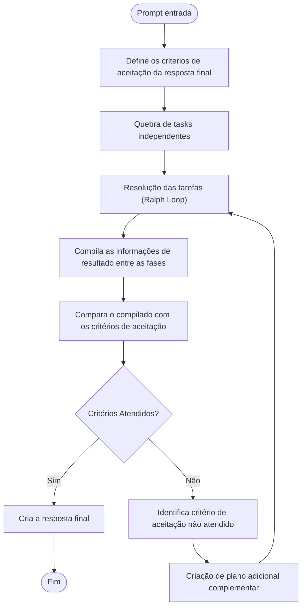

```mermaid
flowchart TD

    A([Prompt entrada])

    B["Define os criterios de aceitação da resposta final"]
    C["Quebra de tasks independentes"]
    D["Resolução das tarefas (Ralph Loop)"]
    E["Compila as informações de resultado entre as fases"]
    F["Compara o compilado com os critérios de aceitação"]

    G{"Critérios Atendidos?"}

    H["Cria a resposta final"]
    I([Fim])

    J["Identifica critério de aceitação não atendido"]
    K["Criação de plano adicional complementar"]

    A --> B
    B --> C
    C --> D
    D --> E
    E --> F
    F --> G

    G -- Sim --> H
    H --> I

    G -- Não --> J
    J --> K
    K --> D

```
