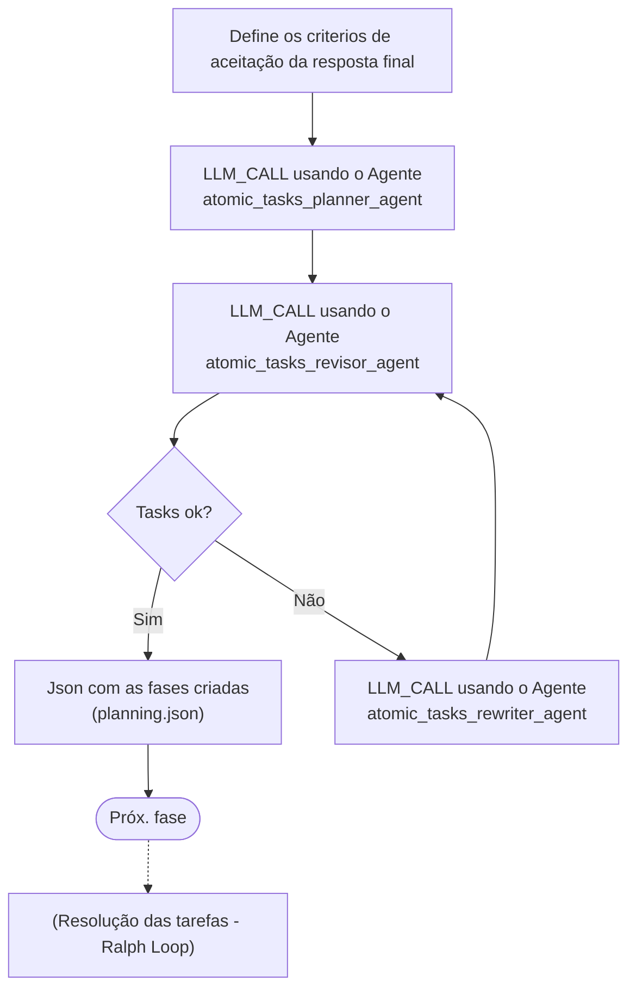

```mermaid
flowchart TD

    A["Define os criterios de aceitação da resposta final"]

    B["LLM_CALL usando o Agente<br/>atomic_tasks_planner_agent"]

    C["LLM_CALL usando o Agente<br/>atomic_tasks_revisor_agent"]

    D{"Tasks ok?"}

    E["LLM_CALL usando o Agente<br/>atomic_tasks_rewriter_agent"]

    F["Json com as fases criadas<br/>(planning.json)"]

    G([Próx. fase])
    H["(Resolução das tarefas - Ralph Loop)"]

    A --> B
    B --> C
    C --> D

    D -- Sim --> F
    D -- Não --> E

    E --> C

    F --> G
    G -.-> H
```
