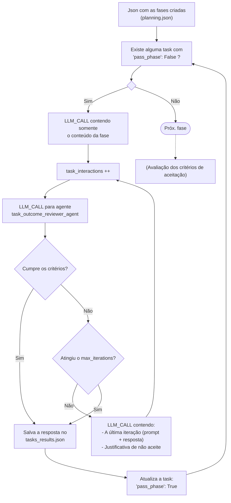

```mermaid
flowchart TD

    A["Json com as fases criadas<br/>(planning.json)"]

    B["Existe alguma task com<br/>'pass_phase': False ?"]

    C{" "}

    D["LLM_CALL contendo somente<br/>o conteúdo da fase"]

    E["task_interactions ++"]

    F["LLM_CALL para agente<br/>task_outcome_reviewer_agent"]

    G{"Cumpre os critérios?"}

    H{"Atingiu o max_iterations?"}

    I["LLM_CALL contendo:<br/>- A última iteração (prompt + resposta)<br/>- Justificativa de não aceite"]

    J["Salva a resposta no<br/>tasks_results.json"]

    K["Atualiza a task:<br/>'pass_phase': True"]

    L([Próx. fase])

    M["(Avaliação dos critérios de aceitação)"]

    A --> B
    B --> C

    C -- Sim --> D
    C -- Não --> L

    D --> E
    E --> F
    F --> G

    G -- Sim --> J

    G -- Não --> H

    H -- Não --> I
    I --> E

    H -- Sim --> J

    J --> K
    K --> B

    L -.-> M
```
