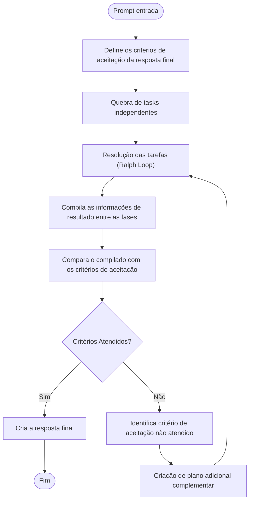
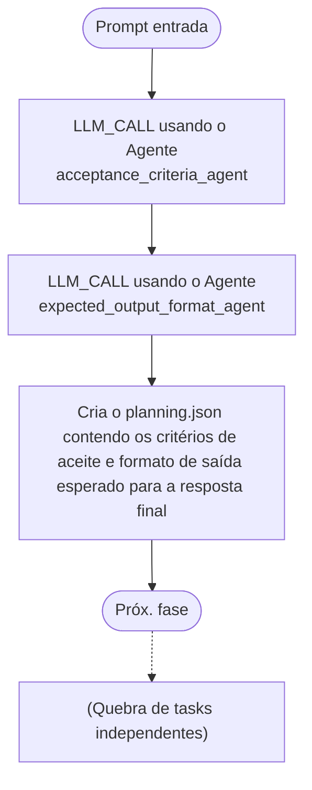
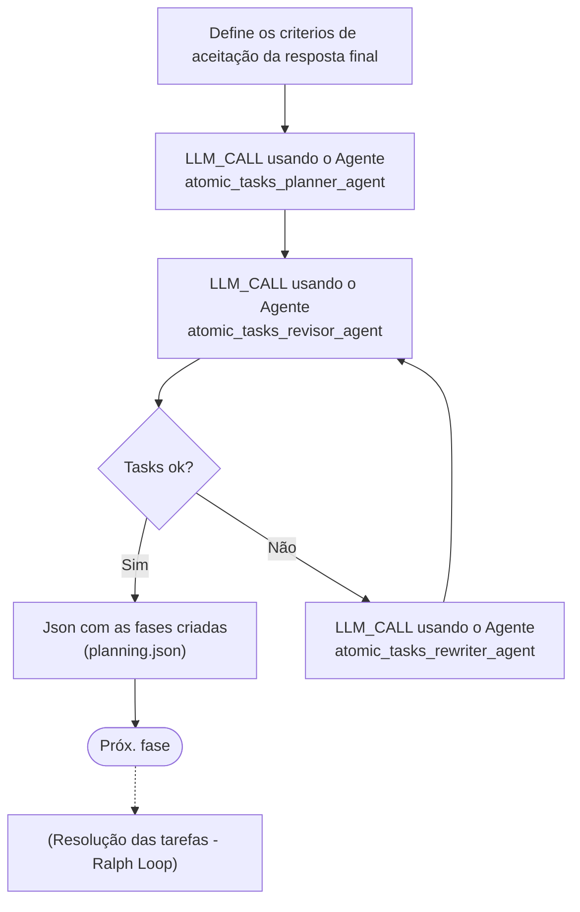
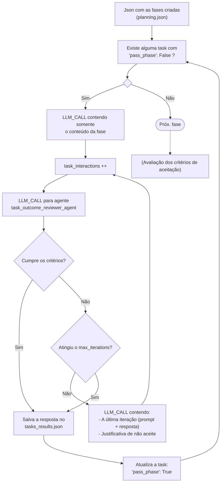
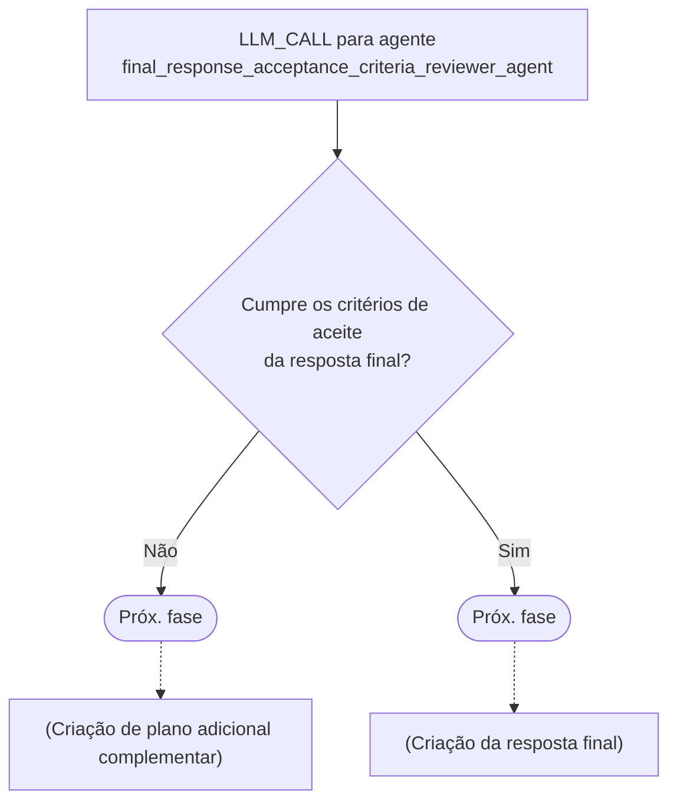
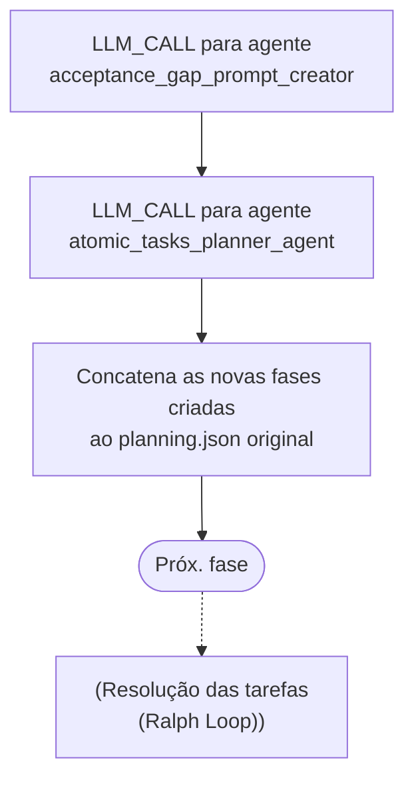
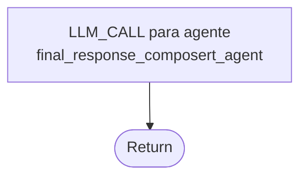

## METODOLOGIA

### Análise macro do processo de *thinking*

O diagrama a seguir apresenta o fluxo macro do pipeline de *thinking* proposto neste trabalho, oferecendo uma visão consolidada de todas as fases que o compõem.



O pipeline é iniciado a partir de um *prompt* de entrada fornecido pelo usuário. A partir desse insumo, o processo percorre as seguintes etapas em sequência: (i) definição dos critérios de aceitação da resposta final e do formato de saída esperado; (ii) decomposição do problema em tarefas atômicas e independentes; (iii) resolução iterativa de cada tarefa por meio de um ciclo de execução e verificação inspirado no *Ralph Wiggum Loop*; (iv) avaliação dos resultados consolidados frente aos critérios de aceitação estabelecidos; e, por fim, (v) composição da resposta final ao usuário. Caso a avaliação dos critérios indique que nem todos foram atendidos, o pipeline não descarta o trabalho realizado — em vez disso, cria um plano adicional complementar voltado exclusivamente para cobrir as lacunas identificadas, retornando à fase de resolução de tarefas. Esse comportamento confere ao sistema um caráter iterativo e convergente.

Um aspecto central da arquitetura é a separação deliberada entre as fases de execução: cada etapa opera de forma *stateless* em relação às demais, no sentido de que não carrega diretamente o histórico de raciocínio das fases anteriores. Em vez disso, o sistema preserva apenas artefatos estruturados — em especial os arquivos `planning.json` e `tasks_results.json` — que funcionam como memória persistente e controlada entre as etapas. Essa decisão de projeto tem dois objetivos complementares: por um lado, mitigar os problemas de degradação discutidos na Introdução, nos quais o crescimento progressivo do contexto leva ao fenômeno frequentemente referido como *context rot* — o acúmulo de informação irrelevante, resumos implícitos e ruído que diluem o conteúdo útil e prejudicam a qualidade das respostas —; por outro, garantir que cada chamada ao LLM opere com o menor contexto possível, reduzindo o risco de que informações e raciocínios de tarefas anteriores contaminem a execução da tarefa corrente, introduzindo inconsistências ou "lixo de contexto" nas respostas geradas.

---

### Análise micro das fases

A seguir, cada fase do pipeline é detalhada individualmente. Para cada fase, são descritos: os agentes de LLM envolvidos, os dados de entrada e saída, e o fluxo de controle interno. Essa granularidade tem o objetivo de tornar o processo inteiramente replicável por pesquisadores externos.

#### Agentes de LLM

Neste trabalho, adota-se uma definição restrita de *agente*: trata-se de um componente composto exclusivamente por um *prompt* pré-definido e uma chamada ao modelo de linguagem (*LLM_CALL*). Diferentemente de arquiteturas que atribuem a agentes acesso a ferramentas externas, chamadas a APIs, servidores MCP ou capacidades de navegação, os agentes aqui descritos operam de forma isolada — recebem um contexto de entrada estruturado, processam via LLM e retornam uma saída textual ou estruturada em JSON. Essa restrição é intencional: ao eliminar dependências externas, torna-se possível avaliar de forma mais direta o impacto da orquestração e do *prompting* sobre a qualidade das respostas, isolando as variáveis de interesse do estudo.

Todos os *prompts* de agentes são redigidos em inglês. Estudos como o de Huang et al. [14] e Shi et al. [15] mostram que modelos de linguagem multilíngues tendem a produzir resultados de maior qualidade quando instruídos no idioma em que foram mais amplamente treinados — predominantemente o inglês —, independentemente do idioma da questão de entrada. Qin et al. [16] reforçam esse achado ao demonstrar que a combinação de *prompting* em inglês com raciocínio *zero-shot* em cadeia produz ganhos consistentes mesmo em línguas de menor representação nos dados de treinamento. A adoção do inglês como idioma padrão dos *prompts* de agentes visa, portanto, maximizar a qualidade do raciocínio interno do modelo, sem prejuízo ao idioma da resposta entregue ao usuário — que é determinado separadamente, conforme descrito na seção seguinte.

Adicionalmente, todos os *prompts* são construídos utilizando a sintaxe *Markdown*, com delimitadores explícitos de seção para separar instruções gerais, contexto de entrada e especificações de saída. Estudos como o de He et al. [17] e Liu et al. [18] mostram que a formatação do *prompt* afeta de forma mensurável o desempenho dos modelos, e que otimizações conjuntas de conteúdo e formato produzem ganhos adicionais sobre a otimização exclusiva do conteúdo textual. A adoção de *Markdown* visa, portanto, tornar delimitadores, hierarquias e restrições mais salientes durante a inferência, contribuindo para respostas mais consistentes com as instruções fornecidas.

---

#### Definição dos critérios de aceite da resposta final



Esta fase é responsável por transformar o *prompt* bruto do usuário em dois artefatos que guiarão todo o processo posterior: (i) uma lista de critérios de aceitação que a resposta final deverá satisfazer, e (ii) uma especificação do formato de saída esperado. Para isso, dois agentes são acionados em sequência a partir da mesma entrada.

O `acceptance_criteria_agent` recebe o *prompt* de entrada do usuário e é responsável por identificar e listar, de forma explícita, os critérios objetivos e verificáveis que uma resposta satisfatória deve cumprir. Em seguida, o `expected_output_format_agent` analisa o mesmo *prompt*, buscando por indicações explícitas de formato de saída — como "retorne somente a alternativa correta", "responda em JSON" ou "elabore uma justificativa". Caso nenhuma indicação seja encontrada, o agente infere o formato mais adequado ao tipo de tarefa: para questões de múltipla escolha, o padrão é "retornar somente a letra da alternativa correta, sem explicações adicionais"; para questões abertas, "texto corrido em formato Markdown". O idioma da resposta final é tratado como parte integrante do formato de saída: se o usuário o especificou explicitamente, essa instrução é acatada; caso contrário, o agente infere o idioma a partir do idioma utilizado na entrada e o registra como especificação. Quando exemplos de saída são fornecidos pelo usuário, estes são incorporados ao campo correspondente.

Os resultados dessas duas chamadas são então consolidados em um arquivo JSON denominado `planning.json`, que servirá de artefato central de memória estruturada para todas as fases subsequentes. A estrutura do `planning.json` é inspirada no `prd.json` do *Ralph Wiggum Loop* original, porém estendida para incorporar as informações de critérios de aceitação e formato de saída — dimensões ausentes no contexto original de desenvolvimento de software, mas essenciais para a avaliação de respostas em benchmarks de múltipla escolha. O formato inicial desse arquivo é o seguinte:

```json
{
    "general_infos": {
        "acceptance_criteria": [],
        "expected_output_format": {
            "format": "",
            "response_language": ""
        }
    },
    "tasks": []
}
```

A título de exemplo, um `planning.json` preenchido para uma questão de múltipla escolha em português teria o seguinte aspecto:

```json
{
    "general_infos": {
        "acceptance_criteria": [
            "A resposta deve identificar a alternativa correta",
            "A resposta deve ser objetiva, sem explicações adicionais"
        ],
        "expected_output_format": {
            "format": "Retornar somente a letra da alternativa correta (A, B, C, D ou E), sem explicações adicionais.",
            "response_language": "Portuguese"
        }
    },
    "tasks": []
}
```

O campo `tasks` é inicialmente vazio e será preenchido pela fase seguinte. A separação entre `general_infos` e `tasks` é proposital: as informações gerais são invariantes ao longo de todo o pipeline, enquanto as tarefas podem ser adicionadas iterativamente por planos complementares.

##### Prompts dos agentes

**`acceptance_criteria_agent`**

```markdown
# Agent: Acceptance Criteria Definer

## Goal
You are a specialized agent that analyzes user requests and derives clear, objective, and
verifiable acceptance criteria for the expected final response.

## Instructions
Based on the user prompt provided below, identify and list all criteria that a satisfactory
response must fulfill.

### Rules
- Each criterion must be atomic and independently verifiable
- Criteria must be derived from what the user requested, not from external assumptions
- Express each criterion as a positive statement (e.g., "The response must contain X")
- List between 2 and 6 criteria

## Input

### User prompt
{{USER_PROMPT}}

## Expected output
Return exclusively a JSON array with the acceptance criteria, with no additional text,
no wrapping code blocks, and no explanations.

### Empty example
    ```json
    []
    ```

### Populated example
    ```json
    [
        "The response must identify the correct answer option",
        "The response must be concise and free of unnecessary explanations"
    ]
    ```
```

**`expected_output_format_agent`**

```markdown
# Agent: Output Format Definer

## Goal
You are a specialized agent that identifies or infers the expected output format and response
language for a user's request.

## Instructions
Analyze the user prompt below and determine the appropriate output format and response
language for the final answer.

### Rules
- If the user explicitly specified a format (JSON, Markdown, plain text, single option, etc.),
  use that format
- If the user provided output examples, include them in the format description
- If no format was specified, infer the most appropriate format for the task type:
  - For multiple-choice questions: "Return only the letter of the correct answer option,
    with no additional explanation"
  - For open-ended questions: "Continuous text in Markdown format"
- For the response language:
  - If the user explicitly specified a language, use it
  - If not, infer the language from the user's input and use that same language

## Input

### User prompt
{{USER_PROMPT}}

## Expected output
Return exclusively a JSON object in the following format, with no additional text,
no wrapping code blocks, and no explanations.

### Empty example
    ```json
    {
        "format": "",
        "response_language": ""
    }
    ```

### Populated example
    ```json
    {
        "format": "Return only the letter of the correct answer option (A, B, C, D or E), with no additional explanation.",
        "response_language": "Portuguese"
    }
    ```
```

---

#### Quebra de Tasks Independentes



Esta fase é, em termos de responsabilidade lógica, a mais crítica de todo o pipeline: é aqui que se implementa o princípio central do *Ralph Wiggum Loop* — a decomposição do problema em unidades mínimas e independentes de execução. O agente `atomic_tasks_planner_agent` recebe como entrada o *prompt* do usuário e o campo `general_infos` do `planning.json` gerado na fase anterior, e a partir disso constrói um plano de tarefas atômicas.

O conceito de *atomicidade* empregado é preciso: uma tarefa é considerada atômica quando representa a menor unidade de trabalho possível e pode ser executada e avaliada de forma completamente independente das demais tarefas do plano, sem necessidade de acessar ou reutilizar os resultados de outras tarefas durante sua própria execução. Essa propriedade é fundamental para garantir o funcionamento correto do mecanismo de *fresh context* — se tarefas dependessem umas das outras durante a execução, seria necessário carregar contexto acumulado, o que re-introduziria os problemas de degradação que a arquitetura busca mitigar.

Após a geração do plano inicial, o agente `atomic_tasks_revisor_agent` é acionado para verificar se todas as tarefas propostas satisfazem o critério de independência, retornando um JSON com um campo booleano de aprovação e uma justificativa. Se problemas forem identificados, o agente `atomic_tasks_rewriter_agent` — que incorpora em seu *prompt* todas as regras e restrições do planejador — é acionado para reescrever o plano com base na justificativa fornecida. Esse ciclo de revisão repete-se até que o revisor valide o plano, garantindo que apenas tarefas verdadeiramente independentes avancem para a fase de execução.

Cada tarefa do plano é representada no `planning.json` no seguinte formato:

```json
{
    "general_infos": {
        "acceptance_criteria": [],
        "expected_output_format": {
            "format": "",
            "response_language": ""
        }
    },
    "tasks": [
        {
            "id": "",
            "title": "",
            "description": "",
            "acceptance_criteria": [],
            "pass_phase": false
        }
    ]
}
```

A título de exemplo, um `planning.json` com tarefas preenchidas teria o seguinte aspecto:

```json
{
    "general_infos": {
        "acceptance_criteria": [
            "A resposta deve identificar a alternativa correta",
            "A resposta deve ser objetiva, sem explicações adicionais"
        ],
        "expected_output_format": {
            "format": "Retornar somente a letra da alternativa correta (A, B, C, D ou E), sem explicações adicionais.",
            "response_language": "Portuguese"
        }
    },
    "tasks": [
        {
            "id": "1",
            "title": "Identify the knowledge domain and key concepts",
            "description": "Read the following question and identify: (1) its primary knowledge domain, and (2) the key concepts required to answer it. Question: 'Which of the following best describes the concept of entropy in thermodynamics? A) A measure of disorder or randomness in a system. B) The total kinetic energy of all molecules. C) The energy available to do work. D) The rate of heat transfer between systems.'",
            "acceptance_criteria": [
                "The response must identify the primary domain",
                "The response must list the key concepts required to evaluate each answer option"
            ],
            "pass_phase": false
        },
        {
            "id": "2",
            "title": "Evaluate each answer option independently",
            "description": "Evaluate each of the four options below against the standard thermodynamic definition of entropy and determine whether each is correct or incorrect. Standard definition: entropy is a measure of the disorder or randomness of a system, related to the number of possible microscopic configurations. Options: A) A measure of disorder or randomness in a system. B) The total kinetic energy of all molecules. C) The energy available to do work. D) The rate of heat transfer between systems.",
            "acceptance_criteria": [
                "Each option must be individually assessed as correct or incorrect",
                "The assessment must include a brief justification for each option"
            ],
            "pass_phase": false
        }
    ]
}
```

O campo `pass_phase` é inicializado como `false` para todas as tarefas e atualizado para `true` ao final da execução bem-sucedida de cada uma, funcionando como marcador de progresso para o mecanismo de iteração descrito na seção seguinte.

##### Prompts dos agentes

**`atomic_tasks_planner_agent`**

```markdown
# Agent: Atomic Task Planner

## Goal
You are a specialized agent that decomposes complex problems into minimal, atomic, and
completely independent execution units.

## Core Concept: Atomicity and Independence
A task is **atomic** when it represents the smallest possible unit of work needed to
make progress toward solving the problem.
A task is **independent** when it can be executed and evaluated without requiring the
results of any other task in the plan.

### Independence Rule (CRITICAL)
Each task must be self-contained. This means:
- A task MUST NOT assume it will have access to the result of another task during its execution
- All context needed to solve the task must be present within the task's own description
- If information that would be produced by another task is needed, it must be re-specified
  directly in this task's description

## Input

### User prompt
{{USER_PROMPT}}

### General information (planning.json > general_infos)
{{GENERAL_INFOS}}

## Expected output
Return exclusively a JSON array with the tasks, with no additional text, no wrapping code
blocks, and no explanations.

### Empty example
    ```json
    []
    ```

### Populated example
    ```json
    [
        {
            "id": "1",
            "title": "Identify the knowledge domain and key concepts",
            "description": "Read the following question and identify: (1) its primary knowledge domain, and (2) the key concepts required to answer it. Question: 'Which of the following best describes entropy in thermodynamics?'",
            "acceptance_criteria": [
                "The response must identify a single primary domain",
                "The response must list the key concepts required to evaluate the answer options"
            ],
            "pass_phase": false
        }
    ]
    ```
```

**`atomic_tasks_revisor_agent`**

```markdown
# Agent: Atomic Task Reviewer

## Goal
You are a specialized agent that reviews task plans to ensure all tasks are truly independent
and atomic.

## Review Criterion
Check whether any task in the plan, in order to be executed, would need to consult or reuse
the result of another task in the same plan. If so, the plan is incorrect and must be rejected.

## Input

### Task plan to review
{{TASKS_PLAN}}

## Expected output
Return exclusively a JSON object in the following format, with no additional text, no wrapping
code blocks, and no explanations.

### Empty example
    ```json
    {
        "approved": null,
        "justification": ""
    }
    ```

### Populated example — approval
    ```json
    {
        "approved": true,
        "justification": "All tasks are independent and atomic."
    }
    ```

### Populated example — rejection
    ```json
    {
        "approved": false,
        "justification": "Task 2 ('Calculate the average of the results') depends on the output of task 1 ('Collect the data'). The description of task 2 must include the necessary data directly, or both tasks must be merged into a single self-contained task."
    }
    ```
```

**`atomic_tasks_rewriter_agent`**

```markdown
# Agent: Atomic Task Rewriter

## Goal
You are a specialized agent that corrects task plans with dependency issues between tasks,
rewriting them to ensure full atomicity and independence.

## Core Concept: Atomicity and Independence
A task is **atomic** when it represents the smallest possible unit of work.
A task is **independent** when it can be executed and evaluated without requiring the results
of any other task in the plan.

### Independence Rule (CRITICAL)
- A task MUST NOT assume it will have access to the result of another task during its execution
- All context needed must be present within the task's own description
- If information from another task is needed, it must be re-specified directly in this
  task's description

## Input

### Original task plan
{{TASKS_PLAN}}

### Rejection justification
{{REJECTION_JUSTIFICATION}}

### General information (planning.json > general_infos)
{{GENERAL_INFOS}}

## Instructions
Correct the task plan based on the rejection justification provided, ensuring all resulting
tasks are atomic and independent.

## Expected output
Return exclusively the corrected JSON array with the tasks, with no additional text, no
wrapping code blocks, and no explanations. Maintain the same format as the original plan.

### Empty example
    ```json
    []
    ```

### Populated example
    ```json
    [
        {
            "id": "1",
            "title": "Identify domain and evaluate all answer options",
            "description": "Read the following question, identify its primary knowledge domain, and evaluate each answer option independently. Standard definition of entropy: a measure of the disorder or randomness of a system. Question: 'Which of the following best describes entropy in thermodynamics? A) A measure of disorder. B) Total kinetic energy. C) Energy available to do work. D) Rate of heat transfer.'",
            "acceptance_criteria": [
                "The response must identify the primary domain",
                "Each answer option must be individually assessed as correct or incorrect with justification"
            ],
            "pass_phase": false
        }
    ]
    ```
```

---

#### Resolução das tarefas — Ralph Loop



Esta fase implementa o núcleo iterativo do *Ralph Wiggum Loop* adaptado ao contexto deste trabalho. O processo inicia pela verificação do `planning.json`: enquanto existirem tarefas com `pass_phase: false`, o pipeline seleciona a próxima tarefa pendente e inicia um ciclo de tentativa–avaliação–revisão.

Cada iteração do ciclo consiste em: (i) uma chamada ao LLM contendo exclusivamente o conteúdo da tarefa atual — sem histórico acumulado de outras tarefas —, seguida de (ii) uma chamada ao agente `task_outcome_reviewer_agent`, que compara a resposta gerada com os `acceptance_criteria` da tarefa. O revisor retorna um JSON com um campo booleano de aprovação e uma justificativa. Se o revisor aprovar a resposta, ela é salva no arquivo `tasks_results.json` e o campo `pass_phase` da tarefa é atualizado para `true`. Se reprovar, a justificativa é incorporada à próxima chamada ao LLM, que recebe como contexto a última tentativa (prompt + resposta gerada) e a razão de não-aceitação — configurando um ciclo de refinamento guiado, análogo ao mecanismo de *Reflexion* [7] e *Self-Debugging* [8] discutidos na Introdução.

No que diz respeito à persistência dos resultados, adota-se uma adaptação do princípio original do *Ralph Wiggum Loop*, que preconiza que *"All memory lives in files and git — not the model"*. Como o presente trabalho aplica o pipeline a cenários distintos do desenvolvimento de software, o mecanismo de *commit* em repositório Git é substituído pelo arquivo `tasks_results.json`, que acumula exclusivamente as respostas finais aprovadas de cada tarefa — sem registrar histórico de raciocínio, tentativas anteriores ou qualquer metadado do ciclo iterativo. É importante destacar que nenhuma fase do pipeline possui acesso ao conteúdo desse arquivo durante a execução das tarefas: o `tasks_results.json` permanece opaco ao longo de toda a fase de resolução, sendo recuperado somente ao final do pipeline, na fase de criação da resposta final. Esse isolamento reforça o princípio *stateless* entre iterações — cada tarefa é executada com um contexto limpo (*fresh context*), sem visibilidade sobre o que foi produzido pelas tarefas anteriores.

Para mitigar o risco de *deadlock* — situação na qual o modelo entra em ciclo indefinido sem conseguir satisfazer os critérios de uma tarefa —, implementa-se um mecanismo de controle denominado *pânico*. Um contador `task_interactions` é incrementado a cada chamada ao LLM dentro do ciclo de uma tarefa. Quando esse contador atinge o valor de `max_iterations` (parâmetro configurável do pipeline), a fase encerra automaticamente e a resposta disponível no momento é salva no `tasks_results.json`, mesmo que os critérios não tenham sido plenamente atendidos. Esse mecanismo garante a terminação do processo em cenários adversos, impedindo que uma tarefa de difícil convergência bloqueie indefinidamente o pipeline.

##### Prompts dos agentes

**`task_outcome_reviewer_agent`**

```markdown
# Agent: Task Outcome Reviewer

## Goal
You are a specialized agent that evaluates whether the response generated for a task fully
satisfies its acceptance criteria.

## Instructions
Compare the provided response against the task's acceptance criteria. Evaluate each criterion
independently and determine whether all of them have been met.

## Input

### Task description
{{TASK_DESCRIPTION}}

### Task acceptance criteria
{{TASK_ACCEPTANCE_CRITERIA}}

### Generated response
{{TASK_RESPONSE}}

## Expected output
Return exclusively a JSON object in the following format, with no additional text, no wrapping
code blocks, and no explanations.

### Empty example
    ```json
    {
        "approved": null,
        "justification": ""
    }
    ```

### Populated example — approval
    ```json
    {
        "approved": true,
        "justification": "All acceptance criteria have been met."
    }
    ```

### Populated example — rejection
    ```json
    {
        "approved": false,
        "justification": "The criterion 'Identify the correct answer option' was not met: the response selected option B, but the analysis indicates the correct answer is C based on the thermodynamic definition of entropy. The criterion 'Be concise' was met."
    }
    ```
```

---

#### Avaliação dos critérios de aceitação



Ao término da resolução de todas as tarefas do plano, o pipeline consolida os resultados armazenados no `tasks_results.json` e os submete a uma avaliação global frente aos critérios de aceitação definidos em `general_infos.acceptance_criteria` do `planning.json`. Essa fase é executada pelo agente `final_response_acceptance_criteria_reviewer_agent`, que recebe ambos os artefatos como entrada.

A lógica é análoga à dos revisores de tarefa individual, porém operando em um nível de abstração superior: em vez de avaliar uma resposta pontual contra critérios locais de uma tarefa, o agente avalia se o conjunto total de resultados gerados fornece insumos suficientes para construir uma resposta final que atenda a todos os critérios globais. Dois fluxos de saída são possíveis a partir dessa avaliação: caso todos os critérios sejam considerados atendidos, o pipeline avança para a criação da resposta final; caso contrário, avança para a criação de um plano adicional complementar.

##### Prompts dos agentes

**`final_response_acceptance_criteria_reviewer_agent`**

```markdown
# Agent: Global Acceptance Criteria Reviewer

## Goal
You are a specialized agent that evaluates whether the set of task results generated throughout
the process contains sufficient information to build a final response that meets all global
acceptance criteria.

## Instructions
Analyze the task results and the global acceptance criteria. Determine whether, based on the
available information, it is possible to build a final response that fully satisfies all
criteria. Do not evaluate the quality of a potential final response — only assess whether
the necessary inputs are present.

## Input

### Global acceptance criteria (planning.json > general_infos > acceptance_criteria)
{{ACCEPTANCE_CRITERIA}}

### Task results (tasks_results.json)
{{TASKS_RESULTS}}

## Expected output
Return exclusively a JSON object in the following format, with no additional text, no wrapping
code blocks, and no explanations.

### Empty example
    ```json
    {
        "approved": null,
        "justification": ""
    }
    ```

### Populated example — approval
    ```json
    {
        "approved": true,
        "justification": "All global acceptance criteria can be met with the available results."
    }
    ```

### Populated example — gap identified
    ```json
    {
        "approved": false,
        "justification": "The criterion 'Present a comparative analysis between options A and C' cannot be met because none of the tasks produced a direct comparison between these two options. Additional information covering this specific comparison would need to be generated."
    }
    ```
```

---

#### Criação de plano adicional complementar



Quando a avaliação global indica que os critérios de aceitação não foram plenamente atendidos, o pipeline não retorna ao início — o que implicaria descartar e reprocessar etapas já concluídas. Em vez disso, adota-se uma estratégia de afunilamento progressivo: o agente `acceptance_gap_prompt_creator` analisa a justificativa retornada pelo revisor global e produz um novo *prompt* no estilo de entrada de usuário, descrevendo exclusivamente o que ainda precisa ser resolvido para cobrir as lacunas identificadas. Esse *prompt* é então submetido ao `atomic_tasks_planner_agent` — o mesmo agente da fase de Quebra de Tasks Independentes —, que gera um novo conjunto de tarefas complementares. Essas novas tarefas são concatenadas ao campo `tasks` do `planning.json` original, e o pipeline retorna à fase de Resolução das Tarefas para executá-las.

Esse mecanismo constitui, na prática, um segundo nível de loop que garante a convergência iterativa do pipeline: a cada ciclo, o conteúdo gerado aproxima-se do que é necessário para satisfazer todos os critérios de aceitação, sem desperdiçar o trabalho já realizado nas iterações anteriores. O reaproveitamento do `atomic_tasks_planner_agent` nesta fase não é acidental — ao reutilizar o mesmo agente, garante-se que as novas tarefas complementares seguem exatamente as mesmas regras de atomicidade e independência estabelecidas para o plano original.

##### Prompts dos agentes

**`acceptance_gap_prompt_creator`**

```markdown
# Agent: Acceptance Gap Prompt Creator

## Goal
You are a specialized agent that analyzes gaps between the results obtained and the unmet
acceptance criteria, generating a new user-style prompt that requests exclusively what is
still missing.

## Instructions
Based on the rejection justification provided by the global reviewer, create a prompt in the
style of a natural user request that clearly and objectively describes only what needs to be
generated to cover the identified gaps.

### Rules
- The generated prompt must read as a natural user request
- It must reference only what is missing, not what has already been produced
- It must be self-contained and must not reference internal pipeline artifacts
  (planning.json, tasks_results.json, etc.)
- It must be specific enough for the task planner to correctly decompose it into atomic tasks

## Input

### Original user prompt
{{ORIGINAL_USER_PROMPT}}

### Rejection justification
{{REJECTION_JUSTIFICATION}}

### Summary of available results
{{TASKS_RESULTS_SUMMARY}}

## Expected output
Return exclusively the text of the new prompt, with no JSON, no code blocks,
and no additional formatting.

### Populated example
Analyze the following multiple-choice question and provide a detailed comparison between
answer options A and C, explaining the key differences and which one better fits the
standard thermodynamic definition of entropy: "Which of the following best describes the
concept of entropy in thermodynamics? A) A measure of the disorder or randomness in a
system. B) The total kinetic energy of all molecules in a system. C) The energy available
to do work in a thermodynamic process. D) The rate at which heat is transferred between
two systems."
```

> **Nota:** O agente `atomic_tasks_planner_agent` utilizado nesta fase é idêntico ao descrito na seção "Quebra de Tasks Independentes". Consultar o *prompt* correspondente naquela seção.

---

#### Criação da resposta final



A fase de criação da resposta final assume que o `tasks_results.json` contém todos os insumos necessários para compor uma resposta que satisfaça integralmente os critérios de aceitação globais — premissa garantida pela fase de avaliação anterior. É nesta fase, e somente nesta, que o conteúdo do `tasks_results.json` é efetivamente recuperado e utilizado: o agente `final_response_composer_agent` recebe como entrada o arquivo completo de resultados, o campo `general_infos.expected_output_format` do `planning.json` e o *prompt* original do usuário, utilizando-os em conjunto para compor a resposta final no formato e idioma especificados. O retorno desse agente é a saída direta do pipeline ao usuário, encerrando o processo de *thinking*.

##### Prompts dos agentes

**`final_response_composer_agent`**

```markdown
# Agent: Final Response Composer

## Goal
You are a specialized agent that synthesizes partial results from multiple tasks into a
cohesive, complete final response strictly in the correct format and language expected
by the user.

## Instructions
Based on the task results and the specified output format, build the final response for
the user.

### Rules
- The response must strictly adhere to the specified output format, including the
  response language
- Do not mention the internal process (tasks, planning, decomposition, etc.)
- The response must be self-contained and understandable without any additional context
- For multiple-choice questions, return exclusively in the specified format, without
  unsolicited elaboration

## Input

### Original user prompt
{{USER_PROMPT}}

### Expected output format (planning.json > general_infos > expected_output_format)
{{EXPECTED_OUTPUT_FORMAT}}

### Task results (tasks_results.json)
{{TASKS_RESULTS}}

## Expected output
Return exclusively the final response in the specified format and language,
with no additional text.
```
